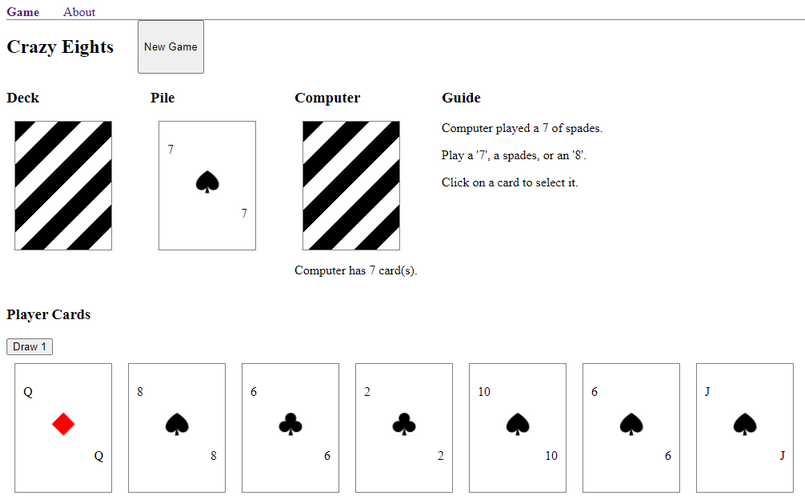
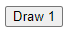
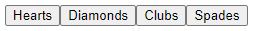

# CRAZY EIGHTS

This card game app was built as part of the [Mintbean](https://mintbean.io/) 'Hiring Hackathon for Jr Web Devs' (Jul 27, 2021 to Aug 3, 2021). The front-end react/redux app implements a modified version of the Crazy Eights card game.

## GAME RULES

The goal of the game is to get rid of all your cards.

For each card played, the other player must match either the rank or suit of the card. On your turn, you can either draw a card from the deck or play a card.

You can play an '8' card on top of any card. The person who plays the '8' can then select the next suit that needs to be played.

Playing a '2' forces the other player to draw two cards. Alternatively, the other player can counter with another '2' increasing the draw penalty to 4 cards. Players can continue to play '2's, increasing the draw penalty by 2 each time, until one player is out of '2's and forced to draw.

(In the [2-player version of crazy eights](https://www.pagat.com/eights/crazy8s.html), the queen card can be used to force the other player to skip a turn, but that was not implemented as part of this hackaton.)

## HOW TO PLAY

Click on the 'New Game' button to start a new game.

To play, click on the card icons in the 'Player Cards' section or click on the draw button to draw a card.

If you play an eight, you'll be presented with a group of buttons to select the next suit.

Each card played will be displayed on top of the 'Pile'. After you draw or play a card, all your cards will be grayed-out for about 2-3 seconds until the Computer has finished playing. After the computer plays, the 'Guide' section will be updated to indicate what the Computer played, as well as instructions on what you can play next.

The Computer's card count is indicated under the Computer's deck.

When either player gets to 0 cards the game ends. The winner will be indicated in the 'Guide' section.

## RUNNING THE PROJECT

To run the project locally, first clone the project to your local machine.

* `npm run start`
  
  Runs the app in development mode. Open [http://localhost:3000](http://localhost:3000) to view it in the browser.
* `npm run test`:
  
  Launches the test runner in the interactive watch mode. The tests cover various scenarios to test the program's logic.

## TRY IT

The program has been deployed here.
